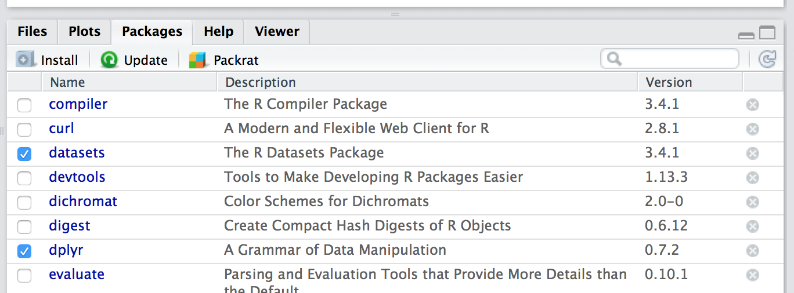

## Stap 1: data ophalen

In dit geval is de databron een SPSS bestand. Hiervoor kunnen we de `foreign` `package` gebruiken. We laden ook een andere handige `package` waar een aantal handige functies in zitten voor databewerking (filteren, transformeren, etc.).

`Packages` zijn verzamelingen van functies rondom thema's. Sommige `packages` zitten bij de standaard installatie van R (zoals `foreign`). Andere (zoals `tidyverse`) dien je zelf te installeren met de `install.packages()` functie of via je de install knop in RStudio.



<br>
In dit geval staat het bestand online, maar je kunt ook verwijzen naar een bestand dat je lokaal hebt opgeslagen. R biedt legio mogelijkheden om verschillende bestandsformaten in te lezen. Zo kun je bijvoorbeeld rechtstreeks uit een database lezen of uit een [Google Spreadsheet](https://cran.r-project.org/web/packages/gsheet/gsheet.pdf) (die bijvoorbeeld gekoppeld is aan een Google Form).

De ingelezen data wijzen we toe aan een variabele `rawData`. De naam van de variabele is een arbitraire keuze. Zorg er echter altijd voor dat je een unieke naam kiest voor een variabele. Tenzij het je expliciete bedoeling is de data die in de variabele is opgeslagen te overschrijven.

```{r}
library(foreign)
library(tidyverse)

rawData <- read.spss("https://github.com/witusj/onderzoek/blob/master/files/enqu%C3%AAte%20woonwensen%20studenten%202016%20data%20in%20SPSS.sav?raw=true", to.data.frame = TRUE)
```

## Stap 2: structuur en kwaliteit van de data beoordelen
Met de functie `str()` kunnen we een globaal overzicht krijgen van de *structuur* van de data.

```{r}
str(rawData)
```
<br>
Het blijkt dat de data is opgeslagen als een *data frame*. Dit het het standaard formaat, waarmee R werkt en het kan in principe als een gewone tabel worden beschouwd met rijen en kolommen. Iedere rij is een observatie (in dit geval `r dim(rawData)[1]` rijen / observaties) en iedere kolom een variabele (`r dim(rawData)[2]`). We hebben dus een variabele `rawData` gedefinieerd die een tabel bevat met observaties en variabelen. Een variabele kan dus weer een verzameling van variabelen bevatten.

Iedere variabele uit de tabel heeft een unieke naam, waarnaar kan worden gerefereerd. De elementen in de variabele (kolom) zijn geindexeerd en kunnen worden opgeroepen.

```{r}
head(rawData$WoLastwens, 10)
rawData$WoLastwens[c(1, 4)]
```
De `c vector` is een speciaal object binnen R. Hier kun je allerlei elementen in opslaan, die je als één `vector` of `list` (= een verzameling van `vectoren`) wilt gebruiken. De elementen kunnen zowel tekst als cijfers zijn (en combinaties daarvan).

<br>

**Tussenvraag 1:** Wat doet de functie `head()`?

<br>
Met de functie `summary()` kan de kwaliteit van de ruwe data worden beoordeeld.

```{r}
summary(rawData)
```

Een aantal variabelen bevatten lege waarden (NA = Not Available). We kunnen die eruit filteren met de `na.omit()` functie. Alle observaties die lege waarden bevatten, zijn nu weggefilterd. Merk op dat de schone data set nu in een nieuwe variabele is opgeslagen `myData`. We beschikken nu dus over twee data sets: één met de ruwe en een andere met de opgeschoonde data.

```{r}
myData <- rawData %>% na.omit()
cat("De nieuwe data set bevat ", dim(myData)[1], " rijen", "\nDe oude data set bevat ", dim(rawData)[1], " rijen\n")
summary(myData)
```
<br>
**Tussenvraag 2:** Wat doen de functies `cat()` en `dim()`?

We zien nu echter dat ongeveer `r (1-round(dim(myData)[1]/dim(rawData)[1], 2))*100`% van de data is verdwenen. Dit is zeer onwenselijk en we zullen dus moeten dus anders omgaan met lege waarden. Hier komen we later op terug.

## Stap 3: Visuele inspectie
De meeste mensen zijn beter in het beoordelen van data in grafische vorm dan als tabel. De standaar installatie van R bevat een aantal goede standaard functies voor grafieken. Een veelgebruikte `package` is echter `ggplot2`. Deze hebben we al eerder geladen met de `package` `tidyverse`.

We kunnen kijken of er verbanden bestaan tussen huidige woonsituatie en de woonoppervlakte.

```{r}
myPlot <- ggplot(rawData, aes(x = WoSitnu, y = WoOppnu)) +
  geom_jitter(colour = 'red', size = 2, width = 0.15) +
  # voeg hier een nieuwe layer toe met geom_point() +
  theme(axis.text.x = element_text(angle = 45, hjust = 1))
myPlot
```
<hr>

`ggplot` werkt met `layers`. Als eerste definieren we de databron (in ons geval `rawData`) en de x- en y-variabelen (`WoSitnu` en `WoOppnu`).

De volgende `layer` is de `geom_jitter()` functie. Als we de punten zo maar in de grafiek zouden laten tekenen, zou er veel overlap zijn. Door wat `random noise` toe te voegen, worden alle punten zichtbaar en wordt de spreiding beter zichtbaar. We kunnen hier onder de kleur en de grootte van de punten aangeven en hoever ze van elkaar verspreid worden (mate van `noise`).

De laatste `layer` - `theme()` - bepaalt de opmaak van grafiek. Hier kunnen we de orientatie van de tekstlabels op de x-as opgeven en de leesbaarheid verhogen.

<br>
**Tussenvraag 3:** Voeg een layer toe met `geom_point()`, geef het de kleur blauw en bekijk het verschil.

## Stap 4: Data voorbereiding
We hebben al eerder getracht de kwaliteit van de data te verbeteren door alle NA's te elimineren. Daarmee hielden we de observaties over die volledig compleet waren. Echter hiermee werd de omvang van de data extreem klein, wat een probleem kan betekenen voor de betrouwbaarheid van eventuele statistische toetsen.


